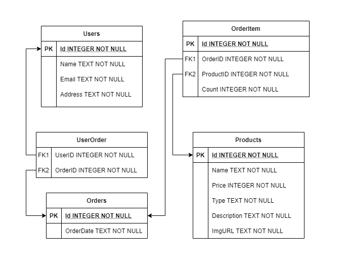

# GraphQL API

Ukázkový projekt, vytvořený na základě oficiálního [workshopu](https://github.com/ChilliCream/graphql-workshop).

Příkazy pro vytvoření databáze

```console
dotnet build GraphQL
dotnet ef migrations add Initial --project GraphQL
dotnet ef database update --project GraphQL
```

Spuštění aplikace

```console
dotnet run --project GraphQL
```

[Deploy](https://www.halldorstefans.com/using-sqlite-in-net-core-azure-web-app/) aplikace na Azure.


## Struktura Databáze

Pro jednoduchost uvažujeme schéma pro SQLite databázi.



## Vytvoření Dat (mutace)

Vytvoření uživatele.

```graphql
mutation {
  addUser(input: {
    name: "User"
    email: "user@email.com"
  }) {
    user {
      id
    }
  }
}
```

Vytvoření objednávky.

```graphql
mutation {
  addOrder(input: {
    orderDate:  "2020-10-14 12:00:00.0"
  }) {
   order {
     id
   }
  }
}
```

## Dotazy nad daty (query)

Výběr id a jmen všech uživatelů

```graphql
query {
  users {
    id
    name
  }
}

```

Výběr id a data všech objednávek

```graphql
query {
  orders {
    id
    orderDate
  }
}
```

Výběr uživatele podle id.

```graphql
query {
  user(id: 1) {
    name
    email
  }
}
```

Paralelní vykonávání dotazů.

```graphql
query {
  a: users {
    name
  }
  b: users {
    name
  }
  c: users {
    name
  }
}
```

### Vnořené dotazy (spojení tabulek)

Přiřazení objednávky k uživateli

```graphql
mutation AddUsersOrder {
  addUsersOrder(input: {
    userId: 1
    orderIds: [1, 2]
  }) {
    user {
      id
    }
  }
}
```

```graphql
query {
  users {
    name
    orders {
      orderDate
    }
  }
}
```

## Product

```graphql
mutation {
  addProduct(input: {
    name: "NVIDIA GeForce RTX 3080",
    price: 699.0
    description: "The GeForce RTX 3080 delivers the ultra performance that gamers crave, powered by Ampere—NVIDIA’s 2nd gen RTX architecture. It’s built with enhanced RT Cores and Tensor Cores, new streaming multiprocessors, and superfast G6X memory for an amazing gaming experience."
    imgUrl: "https://pisces.bbystatic.com/image2/BestBuy_US/images/products/6429/6429440_sd.jpg"
  }) {
    product {
      id
    }
  }
}
```

```graphql
query {
  products {
    name
    price
  }
}
```

## OrderItem

```graphql
mutation {
  addOrderItem(input: {
    orderId: 1
    productId: 1
    count: 2
  }) {
    orderItem {
      id
    }
  }
}
```

```graphql
query {
  orderItems {
    id
    productId
    orderId
    count
  }
}
```

```graphql
query {
  users {
    name
    orders {
      id
      orderDate
      orderItems {
        productId
        count
      }
    }
  }
}
```

Výběr všeho

```graphql
query {
  users {
    name
    orders {
      id
      orderDate
      orderItems {
        product {
          name
          price
        }
        count
      }
    }
  }
}

```

